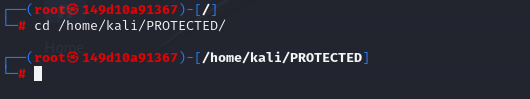

# Escalade de Privilèges avec Docker
Ce tutoriel démontre comment une configuration incorrecte des droits Docker peut mener à une escalade de privilèges.

## Contexte
Des méthodes sont disponibles sur Internet pour changer les droits de Docker, permettant son utilisation sans la commande root. Utiliser simplement la commande docker build peut être considéré comme anormal et non recommandé. L'objectif de ce TP est de montrer qu'une telle configuration "pratique" peut donner un accès complet à la machine.

## Référence
Un exemple de cette pratique est discuté sur ce blog de Julien, où l'auteur suggère que l'utilisation de sudo avec Docker peut créer des failles de sécurité.

Configuration de Docker sans sudo.
Suivez d'abord ce tutoriel pour rendre Docker accessible à un groupe docker plutôt qu'aux seuls sudoers.
https://julienc.io/blog/utiliser_le_client_docker_sans_etre_root

### Ildentification

Identification et Exploitation du Socket Docker
Localisation et observation des droits du socket Docker :

Exécutez la commande suivante pour localiser le socket Docker et observer ses droits.

### Commande pour localiser le socket Docker et obtenir un shell root

Exploitation du socket Docker :

Avec la connaissance des droits accordés, exploitez Docker pour obtenir des privilèges élevés.

Listez des images Docker disponibles, puis utilisez d'une image Docker pour obtenir un shell root :

### Démonstration 

Et voilà nous voilà maintenant root, et un dossier qui n'était pas disponible avec notre utilisateur, l'est désormais.

